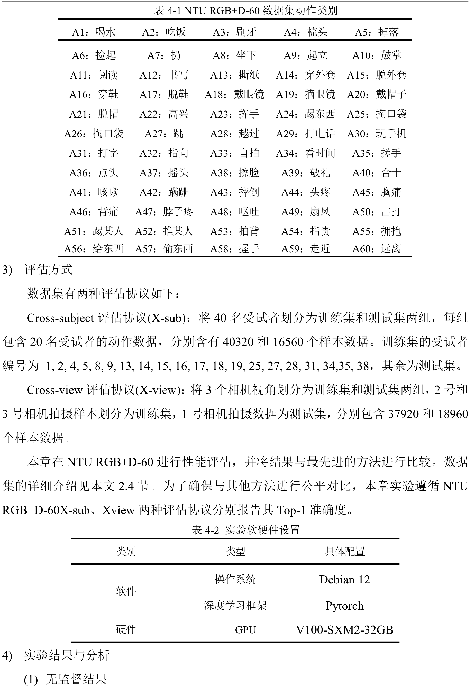
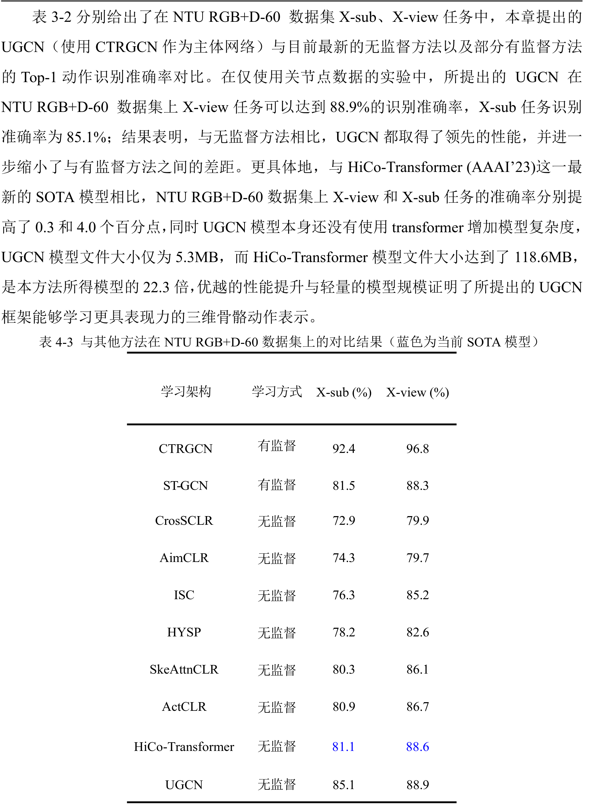
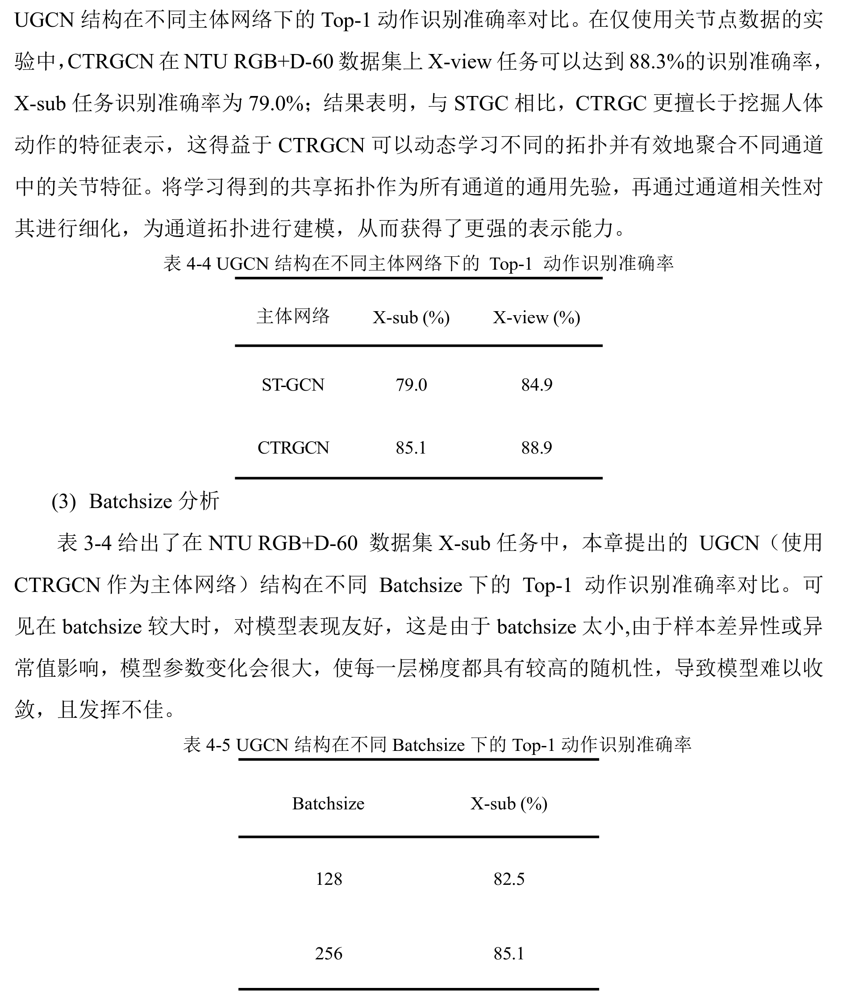

# UGCN

*这是一个稳定版本，足够简练且平稳

## 数据处理

1. Get skeleton of each performer:`python get_raw_skes_data.py`
2. Remove the bad skeleton:`python get_raw_denoised_data.py`
3. Transform the skeleton to the center of the first frame：`python seq_transformation.py`

#### Directory Structure
```
- data/
  - ntu/
  - ntu120/
  - nturgbd_raw/
    - nturgb+d_skeletons/     # from `nturgbd_skeletons_s001_to_s017.zip`
      ...
    - nturgb+d_skeletons120/  # from `nturgbd_skeletons_s018_to_s032.zip`
      ...
```

## 模型训练

```
!OMP_NUM_THREADS=4 torchrun --standalone --nproc_per_node=1 --nnodes=1 pretrain.py --config config/train_cs.yaml --checkpoint-dir runs/pretrain/cs
```

注意：
1. 默认启用了`checkpoint`机制,注意`checkpoint`只支持单阶段，例如预训练得到的权重只服务于预训练阶段，如果要将权重用到测试阶段，则必须使用`gcn.pth`这样的权重
2. 默认将生成文件统一放入`runs/pretrain`

## 模型测试

```
python evaluate.py --epochs 100 --dev cuda:0 --pretrained runs/pretrain/cs/gcn.pth --config config/evaluate_cs.yaml --checkpoint-dir runs/evaluate/cs/
```

## 依赖

```
torch pyyaml tensorboardX einops h5py scikit-learn tqdm
```

## 结果
在 2024 年 6 月之前，本方法在该任务上达到了当时的 SOTA（state-of-the-art）效果。目前我已不再追踪该方向。

本方法在本人毕业论文中取得了该任务的 SOTA 成绩，但尚未在任何期刊或会议上发表。

任何人都可以自由使用或修改本项目的代码。

—— 祝一切顺利。






